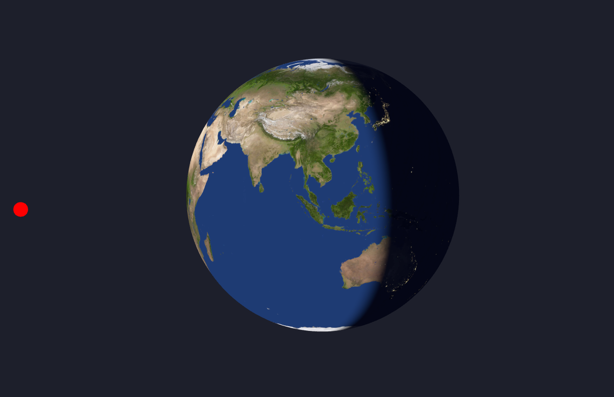

 # [Earth](https://earth.kyledlong.com/)

***** REMEMBER TO CREDIT EARTH TEXTURES
https://www.solarsystemscope.com/

This project showcases WebGL shaders implemented using React Three Fiber (R3F). 
<br>



## Tech

|                   |               |
| ----------------- | ------------- |
| React Three Fiber | WebGL         |
| JS                | Three.js      |
| HTML              | CSS           |
| Vite              | shaders       |


## How to Use
<br>

1. Clone the repository:

```bash
git clone https://github.com/KD-Long/Earth.git
```

2. Install the dependencies:

```bash
cd Earth
npm install
```

3. Run the project:

```bash
npm run dev
```

3. Open your web browser and navigate to http://localhost:5173 to access the project.

# Notes to self

Use leva version 0.9.34 (latest version 0.9.35 is fked, color picker errors out null) 
npm install leva@0.9.34